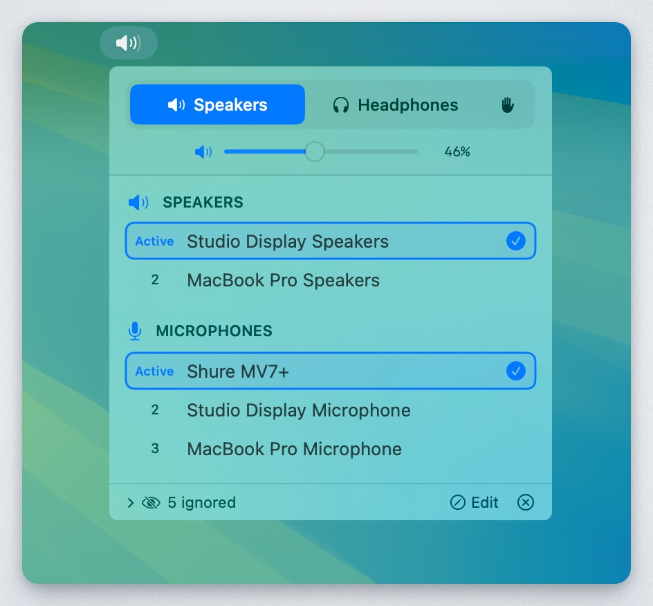

# Audio Priority Bar

<p align="center">
  
</p>

A native macOS menu bar app that automatically manages audio device priorities. Set your preferred order for speakers, headphones, and microphones - the app automatically switches to the highest-priority connected device.




## Features

- **Priority-based auto-switching**: Devices are ranked by priority. When a higher-priority device connects, it automatically becomes active.
- **Separate speaker/headphone modes**: Output devices are categorized as either speakers or headphones, each with their own priority list.
- **Manual override**: Enable "Custom" mode (hand icon) to disable auto-switching and select devices freely.
- **Device memory**: Remembers all devices you've ever connected, even when disconnected. Edit mode shows disconnected devices with "last seen" timestamps.
- **Per-category ignore**: Hide devices from specific categories without affecting others.
- **Drag-to-reorder**: Reorder devices by dragging or using up/down arrows.
- **Volume control**: Adjust volume with slider or scroll wheel.
- **Menu bar integration**: Shows current mode icon and volume percentage.

## Installation

### Requirements
- macOS 13.0 (Ventura) or later

### Build from Source

1. Clone the repository:
   ```bash
   git clone https://github.com/tobi/AudioPriorityBar.git
   cd AudioPriorityBar
   ```

2. Build using the build script:
   ```bash
   ./build.sh
   ```

3. The app will be at `dist/AudioPriorityBar.app`

Or open `AudioPriorityBar.xcodeproj` in Xcode and build with ⌘R.

### Download Release
Check the [Releases](https://github.com/tobi/AudioPriorityBar/releases) page for pre-built binaries.

## Usage

### Modes

| Mode | Icon | Behavior |
|------|------|----------|
| **Speakers** | 🔊 | Shows speaker devices, auto-switches to highest priority |
| **Headphones** | 🎧 | Shows headphone devices, auto-switches to highest priority |
| **Custom** | ✋ | Shows all devices, no auto-switching |

### Managing Priorities

- **Click a device**: Moves it to #1 priority (in normal mode) or just selects it (in custom mode)
- **Drag devices**: Reorder by dragging the handle
- **Up/Down arrows**: Fine-tune order on hover

### Device Actions (hover menu)

- **Move to Speakers/Headphones**: Change device category
- **Ignore as [category]**: Hide from current category only
- **Ignore entirely**: Hide from both speaker and headphone lists
- **Forget Device**: Remove disconnected device from memory

### Edit Mode

Click "Edit" in the footer to:
- See all devices ever connected (disconnected ones grayed out)
- Reorder disconnected devices in the priority list
- View "last seen" timestamps
- Forget old devices you no longer use

## How It Works

1. **Device Discovery**: Uses CoreAudio to enumerate audio devices and listen for changes.
2. **Priority Storage**: Device priorities are stored in UserDefaults, keyed by device UID (stable across reconnects).
3. **Auto-Switching**: When devices connect/disconnect, the app automatically selects the highest-priority available device for the current mode.
4. **Categories**: Each output device is assigned to either "speaker" or "headphone" category, with separate priority lists.

## Project Structure

```
AudioPriorityBar/
├── AudioPriorityBarApp.swift    # App entry, MenuBarExtra, AudioManager
├── Models/
│   └── AudioDevice.swift        # Device model, OutputCategory enum
├── Services/
│   ├── AudioDeviceService.swift # CoreAudio wrapper
│   └── PriorityManager.swift    # Priority persistence
└── Views/
    ├── MenuBarView.swift        # Main popover UI
    └── DeviceListView.swift     # Device list and row components
```

## Contributing

Contributions are welcome! Please feel free to submit a Pull Request.

## License

MIT License - see [LICENSE](LICENSE) for details.

## Acknowledgments

Built with SwiftUI and CoreAudio for macOS.
